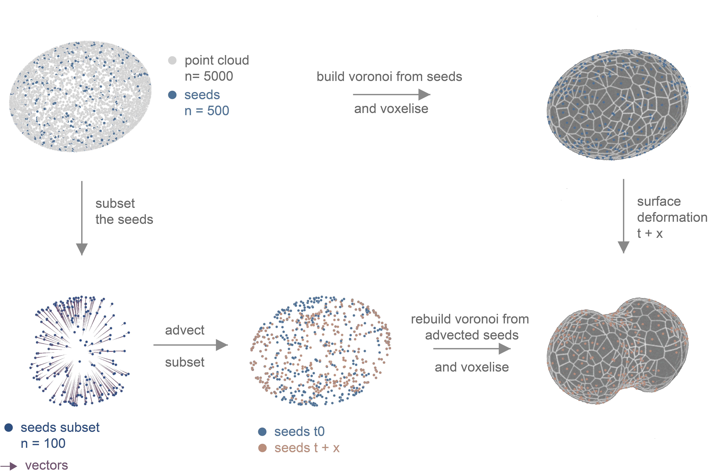
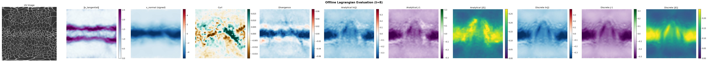

# SEAMLESS — Mesh-Free Neural Kinematics

**SEAMLESS** is a Python package for analyzing shape dynamics and tissue flow in 3D microscopy data. It replaces classical mesh-based pipelines (TubULAR, ImSAnE) with an end-to-end deep learning approach — continuous neural representations instead of triangulated meshes, exact autograd kinematics instead of Discrete Exterior Calculus.

> Active research software. APIs may change.

---

## Why SEAMLESS?



| Classical Tools | SEAMLESS |
|---|---|
| Triangulated meshes prone to topological artifacts | Mesh-free point clouds |
| Manual seam cutting and endcap removal | Neural network with periodic boundary conditions |
| 2D pixel tracking (PIV) with projection errors | 3D-first scene flow, true biological pathlines |
| Discrete Exterior Calculus (DEC) on mesh | Exact continuous calculus via `torch.autograd` |

---

## Installation

```bash
git clone https://github.com/alvillars/seamless.git
cd seamless
pip install -e .
```

**Requirements:** Python ≥ 3.11, PyTorch ≥ 2.0, numpy, scipy, matplotlib, scikit-image, h5py, plotly.

---

## Quick Start

### High-level pipeline (one call)

```python
from seamless import SeamlessPipeline

pipe = SeamlessPipeline(
    volumes,            # list of (Z, Y, X) numpy arrays
    topology='cylinder',
    method='3d_native',
    threshold=43,
)
pipe.run(
    projection_h5='outputs/projection.h5',
    flow_h5='outputs/flow_results.h5',
)
# pipe.frames, pipe.flow_fields, pipe.kinematics are all populated
```

### Step-by-step API

```python
from seamless import Parameterizer, FlowEstimator, KinematicsAnalyzer
from seamless.config import ThreeDNativeConfig

# 1. Parameterize: 3D surface → UV map + max-projection
param = Parameterizer.from_volume(volume, topology='cylinder', threshold=43)
param.train()

# 2. Estimate flow over a frame pair
estimator = FlowEstimator.from_projection_h5(
    'projection.h5',
    source_file='volumes.h5',          # needed for 3d_native method
    three_d_config=ThreeDNativeConfig(),
)
flow_fields = estimator.estimate('3d_native')   # or 'piv' / '2d_neural'

# 3. Kinematics
kin = KinematicsAnalyzer(estimator.frames, flow_fields)
eulerian  = kin.compute_eulerian(flow_fields[0])   # divergence, curl, strain…
lagrangian = kin.compute_lagrangian()              # cumulative strain over time
```

---

## Example Notebooks

Six notebooks in `examples/` cover the full pipeline with a bundled synthetic dataset (ellipsoid waist constriction, 2 timepoints):

| Notebook | What it covers |
|---|---|
| `01_parameterization_workflow.ipynb` | 3D volume → NuVo UV map → max-projection |
| `01_segmentation_to_mapping.ipynb` | Segmentation mask → point cloud → UV mapping |
| `02_flow_comparison_piv_2d_3d.ipynb` | Compare PIV, 2D neural, and 3D native flow side-by-side |
| `02_flow_computation.ipynb` | 3D native flow from start to kinematics dashboard |
| `03_end_to_end_timeseries.ipynb` | Full `SeamlessPipeline` with HDF5 save/reload |
| `03_flow_decomposition.ipynb` | Helmholtz-Hodge decomposition and Lagrangian strain |

```bash
pip install jupyter
jupyter notebook examples/
```

---

## Pipeline Overview

### Step 1 — Parameterization (`Parameterizer`)
Trains a NuVo MLP that maps each surface point to a consistent 2D UV coordinate. Supports warm-starting across timepoints for temporal coherence.

### Step 2 — Projection (`ProjectedFrame`)
Casts the 3D volume onto the learned UV grid via surface-normal sampling, producing a multi-layer intensity stack and a max-projection image.

### Step 3 — Flow Estimation (`FlowEstimator`)
Estimates the 3D velocity field between frame pairs. Three methods:
- **PIV** — classical 2D optical flow lifted to 3D via the NuVo map
- **2D neural** — MLP trained in UV space, lifted to 3D
- **3D native** — MLP trained directly in voxel space via photometric consistency



### Step 4 — Kinematics (`KinematicsAnalyzer`)
Derives deformation metrics analytically from the flow MLP via `torch.autograd`:
- **Eulerian:** divergence, curl, surface strain rate, normal/tangential velocity, vector Laplacian
- **Lagrangian:** cumulative strain and particle pathlines
- **HHD:** Helmholtz-Hodge decomposition into divergence-free, curl-free, and harmonic components

---

## Project Structure

```
seamless/
├── pipeline.py          # High-level API: Parameterizer, FlowEstimator,
│                        #   KinematicsAnalyzer, SeamlessPipeline, ProjectedFrame
├── config.py            # Dataclasses for all method configs
├── cartography/         # NuVo network training and UV projection
├── core/                # Geometry, kinematics math, validation
├── flow/                # Flow networks and training (PIV, 2D, 3D)
├── networks/            # Shared MLP architectures
├── optim/               # Optimization helpers
├── synth/               # Synthetic dataset generation
├── utils/               # HDF5 I/O (loading.py, saving.py)
└── vis/                 # Visualization (napari, matplotlib, plotly)
examples/
├── *.ipynb              # Six quick-start notebooks
└── data/synthetic/      # Bundled sample dataset (2-frame, 256³)
tests/                   # Unit and integration tests
```

---

## License

MIT — see [LICENSE](LICENSE).
